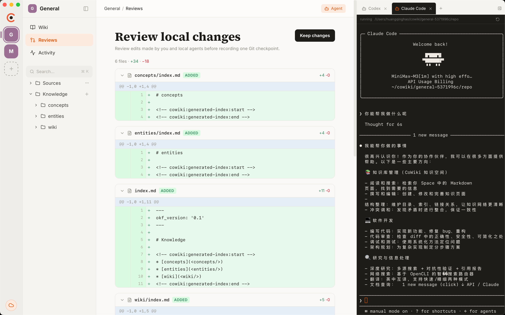
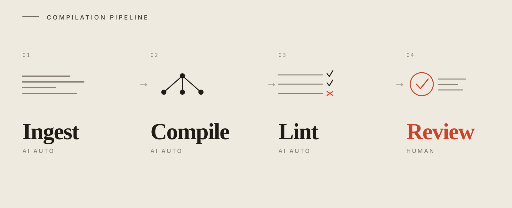

<p align="center">
  
</p>

<h1 align="center">CoWiki: An LLM Wiki, but multiplayer.</h1>

<p align="center">
  <a href="https://github.com/wfnuser/cowiki/actions/workflows/macos-desktop.yml"></a>
  <a href="LICENSE"></a>
  <a href="docs/okf-v0.1.md"></a>
  <a href="https://github.com/wfnuser/cowiki"></a>
  <a href="https://github.com/wfnuser/cowiki/issues"></a>
  <a href="https://github.com/wfnuser/cowiki/graphs/contributors"></a>
</p>

<p align="center">
  
</p>

<p align="center">
  <strong>A local-first, Git-based workspace where teams and their agents compile sources into a portable, reviewable, and shareable LLM Wiki.</strong>
  <br />
  <sub>Bring your own agents. Turn files and URLs into linked OKF knowledge, review every diff, and keep only what you trust.</sub>
</p>

> **macOS-first alpha:** local Spaces work today. Cloud collaboration comes next.

## Features

| Feature | What it means |
| --- | --- |
| **Local Spaces** | A Space is an ordinary folder. No account, server, or external database is required. |
| **Agent-compiled Wiki** | Add URLs, PDFs, documents, spreadsheets, or slides. Agents compile them into structured, linked knowledge. |
| **Bring your own agents** | Use the built-in Codex and Claude terminals, or let Grok, Antigravity, and other file/MCP-capable agents work on the same Space. |
| **Git-based review** | Inspect human and agent edits as diffs, then merge, discard, commit, or checkpoint them. |
| **OKF-native** | CoWiki follows [Google's Open Knowledge Format v0.1](docs/okf-v0.1.md), keeping knowledge readable, linked, and portable. |
| **Collaboration-ready** | The same local Space can later gain cloud publishing, permissions, and team review. |

## Ingest. Compile. Review.

<p align="center">
  
</p>

Drop source material into a Space. Your agents compile it into linked OKF
knowledge, check its structure, and return a Git diff for human review. Keep
the result, continue editing it, or discard the change as a unit.

## Your Space is a folder

```text
research-space/
├── index.md
├── architecture.md
├── projects/
│   └── cowiki.md
├── .cowiki/
│   └── sources/
└── .git/
```

Markdown and Git are the source of truth. SQLite only stores a rebuildable
local search and backlink index. You can open the same files in another
editor, use normal Git tools, or leave CoWiki without exporting anything.

CoWiki aligns Spaces with [Open Knowledge Format v0.1](docs/okf-v0.1.md) and
preserves frontmatter fields it does not understand.

## Local-first, collaboration-ready

CoWiki is local-first, not local-only. Today the desktop app keeps a complete
offline Space and supports local human–agent review. The next layer will let
you publish that same Space for team permissions, browser access, asynchronous
review, and reusable remote MCP—without changing its portable source format.

## Run from source

Requires macOS, Xcode Command Line Tools, [Node.js 24+](https://nodejs.org/),
and [Rust stable](https://rustup.rs/). Install Codex CLI and/or Claude Code to
use the embedded Agent panel.

```bash
git clone https://github.com/wfnuser/cowiki.git
cd cowiki/web
npm ci
npm run desktop:dev
```

Create a Space with an empty local folder, or import an existing folder of
Markdown files. The desktop app runs as a complete standalone workspace.

Agents launched by the app receive CoWiki's read-only local MCP for retrieval
and edit the Space's Markdown files directly. The
[`cowiki-space` skill](skills/cowiki-space/SKILL.md) defines the same contract
for external Agents; local work never requires a CoWiki account, API key, or
backend.

## Roadmap

- Make the macOS alpha easier to install and trust.
- Improve local review and conflict resolution for many agents.
- Publish local Spaces for team permissions, sync, and browser review.
- Offer compatible remote MCP and expand desktop platform support.

## Contributing

CoWiki is early, and the collaboration model is still an open design problem.
Issues, product criticism, experiments, and code are welcome. See
[CONTRIBUTING.md](CONTRIBUTING.md) to get started.


## License

CoWiki is licensed under the [Apache License 2.0](LICENSE).
