# Cowiki Role-Management System 重构设计

> 参考系统: GitHub / Overleaf / 飞书 | 2026-06-05

---

## 总图

```
┌─────────────────────────────────────────────────────────────────────────────┐
│                        Cowiki Role Management v2                             │
├─────────────────────────────────────────────────────────────────────────────┤
│                                                                              │
│  ┌─ 角色体系 (4 级) ────────────────────────────────────────────────────┐  │
│  │                                                                        │  │
│  │   Owner ──── 完全控制，唯一，可删除/转让                               │  │
│  │    │                                                                    │  │
│  │   Manager ── 管理成员+设置+邀请，不可删除/转让                         │  │
│  │    │                                                                    │  │
│  │   Editor ─── 创建/编辑/删除页面，提交/审核                             │  │
│  │    │                                                                    │  │
│  │   Viewer ─── 只读                                                      │  │
│  │                                                                        │  │
│  └────────────────────────────────────────────────────────────────────────┘  │
│                                                                              │
│  ┌─ 数据库 (增量 migration 009) ────────────────────────────────────────┐  │
│  │                                                                        │  │
│  │   保留 001–008 migration，新增 009:                                    │  │
│  │   workspace_members ─ 角色扩展 + 来源追踪 + last_active_at             │  │
│  │   invitations ─────── 角色扩展 + invited_user_id + message/过期/重发   │  │
│  │   ownership_transfers  转让记录表                                      │  │
│  │   向后兼容 ─────────── writer→editor, reader→viewer                    │  │
│  │                                                                        │  │
│  └────────────────────────────────────────────────────────────────────────┘  │
│                                                                              │
│  ┌─ 邀请体系 ────────────────────────────────────────────────────────────┐  │
│  │                                                                        │  │
│  │   User Account 邀请 (id / email / username)                            │  │
│  │   ┌────────────────────────────────────────────────────────────────┐  │  │
│  │   │ invitations 表                                                  │  │  │
│  │   │ · invited_user_id + email + role                                │  │  │
│  │   │ · message (可选)                                                 │  │  │
│  │   │ · expires_at (默认 7 天)                                        │  │  │
│  │   │ · resent_count / last_resent_at                                 │  │  │
│  │   │ · 撤回 / 重发                                                    │  │  │
│  │   │ · 批量发送                                                       │  │  │
│  │   │ · pending 列表按 user_id 匹配，无需 email 比对                    │  │  │
│  │   └────────────────────────────────────────────────────────────────┘  │  │
│  │                                                                        │  │
│  └────────────────────────────────────────────────────────────────────────┘  │
│                                                                              │
│  ┌─ 权限控制 ───────────────────────────────────────────────────────────┐  │
│  │                                                                        │  │
│  │   声明式 PermissionGuard (axum extractor)                              │  │
│  │   · 自动从 DB 获取 member role                                        │  │
│  │   · 路由层声明所需权限                                                 │  │
│  │   · Handler 不再包含角色判断逻辑                                       │  │
│  │                                                                        │  │
│  └────────────────────────────────────────────────────────────────────────┘  │
│                                                                              │
│  ┌─ API 路由 ───────────────────────────────────────────────────────────┐  │
│  │                                                                        │  │
│  │   Workspace CRUD     成员管理         邀请                           │  │
│  │   POST /workspaces    GET members     POST   inv                     │  │
│  │   GET  /workspaces    POST members    GET    inv                     │  │
│  │   GET  /:slug         PATCH role      DELETE inv                     │  │
│  │   PATCH /:slug        DELETE member   POST  resend                   │  │
│  │   DELETE /:slug       POST join       POST  accept                   │  │
│  │   POST transfer       POST add-direct POST  reject                   │  │
│  │                                                                        │  │
│  └────────────────────────────────────────────────────────────────────────┘  │
│                                                                              │
│  ┌─ 转让 Ownership 流程 ────────────────────────────────────────────────┐  │
│  │                                                                        │  │
│  │   Owner 发起                                                           │  │
│  │   ├─ 选择新 Owner                                                      │  │
│  │   ├─ 选择自己降级后的角色 (Manager/Editor/Viewer)                      │  │
│  │   └─ 创建 pending 转让记录                                             │  │
│  │              ↓                                                         │  │
│  │   新 Owner 收到通知 → Accept / Reject                                  │  │
│  │   Accept → 事务: 新 Owner = Owner, 旧 Owner = 选定角色                 │  │
│  │   Reject → 转让取消 (原 Owner 保持 Owner)                              │  │
│  │                                                                        │  │
│  └────────────────────────────────────────────────────────────────────────┘  │
│                                                                              │
└─────────────────────────────────────────────────────────────────────────────┘
```

---

## 目录

1. [设计决策](#1-设计决策)
2. [角色体系](#2-角色体系)
3. [数据库 Schema](#3-数据库-schema)
4. [权限控制](#4-权限控制)
5. [后端 API](#5-后端-api)
6. [前端设计](#6-前端设计) *(后续)*
7. [安全设计](#7-安全设计)
8. [实施计划](#8-实施计划)

---

## 1. 设计决策

| 决策项 | 决定 | 理由 |
|--------|------|------|
| 兼容旧数据库 | 增量 migration 009 + 兼容转换 | 保留 001–008，只新增 009，writer→editor, reader→viewer |
| migration 策略 | 新建 009，在现有基础上叠加 | 最小改动，已有数据库平滑升级 |
| 角色数量 | 4 级 (Owner/Manager/Editor/Viewer) | Reviewer 评论功能未排期，未来再加 |
| 邀请方式 | User Account 邀请 (id/email/username) | 基于已有用户账号，无需分享链接，简化设计 |
| 分享链接 | 不做 | 功能复杂，需求不明确，后续按需添加 |
| 权限检查 | 声明式 PermissionGuard (axum extractor) | Handler 不再含角色判断，权限集中管理 |
| 转让 ownership | 需新 Owner 确认 + 原 Owner 可选降级角色 | 安全，符合 GitHub 惯例 |
| 邀请提醒 UI | 侧边栏 badge + 弹窗 | 不占空间，交互简单 |

---

## 2. 角色体系

### 2.1 四级角色

```
Owner (4) ─── 完全控制，唯一，可删除/转让 workspace
  │
Manager (3) ── 管理成员+设置+邀请，不可删除/转让
  │
Editor (2) ─── 创建/编辑/删除页面，提交/审核内容
  │
Viewer (1) ─── 只读
```

### 2.2 权限矩阵

| 操作 | Owner | Manager | Editor | Viewer |
|------|-------|---------|--------|--------|
| 查看 wiki 内容 | ✅ | ✅ | ✅ | ✅ |
| 创建/编辑页面 | ✅ | ✅ | ✅ | ❌ |
| 删除页面 | ✅ | ✅ | ✅ | ❌ |
| 提交审核 | ✅ | ✅ | ✅ | ❌ |
| 审核通过/拒绝 | ✅ | ✅ | ✅ | ❌ |
| 管理页面结构 | ✅ | ✅ | ✅ | ❌ |
| 邀请成员 | ✅ | ✅ | ❌ | ❌ |
| 移除成员 | ✅ | ✅ | ❌ | ❌ |
| 修改成员角色 | ✅ | ✅ | ❌ | ❌ |
| 修改 workspace 设置 | ✅ | ✅ | ❌ | ❌ |
| 查看成员列表 | ✅ | ✅ | ✅ | ✅ |
| 查看审计日志 | ✅ | ✅ | ❌ | ❌ |
| 删除 workspace | ✅ | ❌ | ❌ | ❌ |
| 转让 ownership | ✅ | ❌ | ❌ | ❌ |
| 加入公开 workspace | ✅ | ✅ | ✅ | ✅ |

### 2.3 角色规则

1. **Owner 唯一** — 每个 workspace 有且仅有一个 Owner
2. **降级安全** — 不能将自己降级到失去管理权
3. **向上受限** — Manager 不能将自己或他人提升为 Owner
4. **权力单向递减** — Owner > Manager > Editor > Viewer

### 2.4 Rust Enum

```rust
#[derive(Debug, Clone, Copy, PartialEq, Eq, PartialOrd, Ord, Serialize, Deserialize)]
#[serde(rename_all = "lowercase")]
pub enum Role {
    Viewer = 1,
    Editor = 2,
    Manager = 3,
    Owner = 4,
}

impl Role {
    pub const ALL: &[Role] = &[Self::Viewer, Self::Editor, Self::Manager, Self::Owner];

    pub fn can_manage(&self) -> bool { *self >= Self::Manager }
    pub fn can_edit(&self) -> bool { *self >= Self::Editor }
    pub fn can_view(&self) -> bool { *self >= Self::Viewer }
    pub fn can_delete_workspace(&self) -> bool { *self == Self::Owner }
    pub fn can_transfer_ownership(&self) -> bool { *self == Self::Owner }

    /// Higher role manages lower role (strictly greater)
    pub fn can_manage_role(&self, target: Role) -> bool {
        *self > target
    }
}
```

---

## 3. 数据库 Schema

> 在现有 migration 001–008 基础上新建 **migration 009**，包含角色扩展 + 新表 + 兼容转换。

### 3.1 ER 图

```mermaid
erDiagram
    workspaces ||--o{ workspace_members : has
    workspaces ||--o{ invitations : has
    workspaces ||--o{ audit_log : records
    users ||--o{ workspace_members : is
    users ||--o{ invitations : "invited_by / invited_user_id"

    users {
        uuid id PK
        string name UK
        string email
        string api_key
        string password_hash
        timestamp created_at
    }

    workspaces {
        uuid id PK
        string name
        string slug UK
        string visibility "private|public"
        uuid created_by FK
        timestamp created_at
    }

    workspace_members {
        uuid workspace_id PK_FK
        uuid user_id PK_FK
        string role "CHECK: owner|manager|editor|viewer"
        uuid invited_by FK
        string joined_via "direct|invitation|public_join"
        timestamp joined_at
        timestamp last_active_at
    }

    invitations {
        uuid id PK
        uuid workspace_id FK
        uuid invited_user_id FK "被邀请用户"
        string email "display only"
        string role "CHECK: owner|manager|editor|viewer"
        uuid invited_by FK "发起邀请者"
        string status "pending|accepted|rejected|expired"
        string message
        timestamp expires_at
        int resent_count
        timestamp last_resent_at
        timestamp created_at
    }

    ownership_transfers {
        uuid id PK
        uuid workspace_id FK
        uuid from_user_id FK
        uuid to_user_id FK
        string previous_owner_new_role "manager|editor|viewer"
        string status "pending|accepted|rejected|cancelled"
        timestamp created_at
    }

    audit_log {
        uuid id PK
        uuid workspace_id FK
        uuid actor_id FK
        string action
        string target_type
        uuid target_id
        jsonb metadata
        timestamp created_at
    }
```



### 3.2 Migration 009 SQL

> 保留现有 001–008 migration，仅新增 009。

```sql
-- ============================================================
-- Migration 009: Enhanced Role System + User Account Invitations
-- Preserves 001–008, adds role expansion + new tables
-- ============================================================

-- 1. 更新 workspace_members 角色约束
ALTER TABLE workspace_members
    DROP CONSTRAINT IF EXISTS workspace_members_role_check;

ALTER TABLE workspace_members
    ADD CONSTRAINT workspace_members_role_check
    CHECK (role IN ('owner', 'manager', 'editor', 'reviewer', 'viewer'));

-- 2. 新增列：来源追踪 + 最后活跃时间
ALTER TABLE workspace_members
    ADD COLUMN IF NOT EXISTS joined_via TEXT NOT NULL DEFAULT 'direct',
    ADD COLUMN IF NOT EXISTS last_active_at TIMESTAMPTZ NOT NULL DEFAULT now();

ALTER TABLE workspace_members
    ADD CONSTRAINT workspace_members_joined_via_check
    CHECK (joined_via IN ('direct', 'invitation', 'public_join'));

-- 3. 更新 invitations: 角色约束 + User Account 邀请 + 新字段
ALTER TABLE invitations
    DROP CONSTRAINT IF EXISTS invitations_role_check;

ALTER TABLE invitations
    ADD CONSTRAINT invitations_role_check
    CHECK (role IN ('owner', 'manager', 'editor', 'reviewer', 'viewer'));

ALTER TABLE invitations
    ADD COLUMN IF NOT EXISTS invited_user_id UUID REFERENCES users(id),
    ADD COLUMN IF NOT EXISTS message TEXT,
    ADD COLUMN IF NOT EXISTS expires_at TIMESTAMPTZ
        DEFAULT (now() + INTERVAL '7 days'),
    ADD COLUMN IF NOT EXISTS resent_count INT NOT NULL DEFAULT 0,
    ADD COLUMN IF NOT EXISTS last_resent_at TIMESTAMPTZ;

CREATE INDEX IF NOT EXISTS idx_invitations_user ON invitations(invited_user_id, status);
CREATE INDEX IF NOT EXISTS idx_invitations_status ON invitations(status);

-- 4. Ownership 转让表
CREATE TABLE IF NOT EXISTS ownership_transfers (
    id UUID PRIMARY KEY DEFAULT gen_random_uuid(),
    workspace_id UUID NOT NULL REFERENCES workspaces(id) ON DELETE CASCADE,
    from_user_id UUID NOT NULL REFERENCES users(id),
    to_user_id UUID NOT NULL REFERENCES users(id),
    previous_owner_new_role TEXT NOT NULL DEFAULT 'manager'
        CHECK (previous_owner_new_role IN ('manager', 'editor', 'viewer')),
    status TEXT NOT NULL DEFAULT 'pending'
        CHECK (status IN ('pending', 'accepted', 'rejected', 'cancelled')),
    created_at TIMESTAMPTZ NOT NULL DEFAULT now()
);

CREATE INDEX IF NOT EXISTS idx_transfers_workspace
    ON ownership_transfers(workspace_id);
CREATE INDEX IF NOT EXISTS idx_transfers_to_user
    ON ownership_transfers(to_user_id, status);

-- 5. 旧角色兼容转换 (向后兼容)
UPDATE workspace_members SET role = 'editor' WHERE role = 'writer';
UPDATE workspace_members SET role = 'viewer' WHERE role = 'reader';
UPDATE invitations SET role = 'editor' WHERE role = 'writer';
UPDATE invitations SET role = 'viewer' WHERE role = 'reader';
```

---

## 4. 权限控制

### 4.1 声明式 PermissionGuard

```rust
/// Permission levels, corresponding to minimum role required.
pub enum Permission {
    ViewContent,        // Viewer+
    EditContent,        // Editor+
    ManageMembers,      // Manager+
    ManageWorkspace,    // Manager+
    DeleteWorkspace,    // Owner only
    TransferOwnership,  // Owner only
}

impl Permission {
    pub fn required_role(&self) -> Role {
        match self {
            Self::DeleteWorkspace | Self::TransferOwnership => Role::Owner,
            Self::ManageMembers | Self::ManageWorkspace => Role::Manager,
            Self::EditContent => Role::Editor,
            Self::ViewContent => Role::Viewer,
        }
    }
}
```

### 4.2 使用方式

采用手动调用模式（非 axum extractor），与路由签名完全兼容：

```rust
// 1. 解析成员身份 + 权限检查
async fn invite(
    State(state): State<Arc<AppState>>,
    headers: HeaderMap,
    Path(slug): Path<String>,
    Json(body): Json<BatchInviteRequest>,
) -> Result<Json<BatchInviteResponse>> {
    let guard = guard::require_membership(&state, &headers, &slug).await?;
    guard::require(&guard, Permission::ManageMembers)?;
    // guard.workspace / guard.user / guard.member_role 已可用
    // ... handler logic
}

// 2. 角色层级管理 (Manager 不能管理同级或上级)
if !guard.member_role.can_manage_role(target_role) {
    return Err(AppError::Forbidden("cannot manage equal or higher role"));
}
```

`require_membership` 内部自动：
- 从 Header 提取用户
- 按 slug 查找 workspace
- 查询 member role
- 更新 `last_active_at` (fire-and-forget)`

### 4.3 路由 → 权限映射

| 路由 | 所需权限 |
|------|----------|
| `DELETE /workspaces/{slug}` | DeleteWorkspace |
| `POST /workspaces/{slug}/transfer-ownership` | TransferOwnership |
| `PATCH /workspaces/{slug}` | ManageWorkspace |
| `POST /workspaces/{slug}/invitations` | ManageMembers |
| `DELETE /workspaces/{slug}/invitations/{id}` | ManageMembers |
| `PATCH /workspaces/{slug}/members/{userId}/role` | ManageMembers |
| `DELETE /workspaces/{slug}/members/{userId}` | ManageMembers |
| `POST /workspaces/{slug}/join` | ViewContent |
| `GET /workspaces/{slug}/members` | ViewContent |
| `POST /workspaces/{slug}/pages/...` | EditContent |
| `GET /workspaces/{slug}/...` | ViewContent |

---

## 5. 后端 API

### 5.1 路由总览

```
# ── Workspace ──
POST   /api/workspaces                                 创建 workspace
GET    /api/workspaces                                 我的 workspace 列表
GET    /api/workspaces/public                          公开 workspace 列表
GET    /api/workspaces/{slug}                          workspace 详情
PATCH  /api/workspaces/{slug}                          更新设置 (Manager+)
DELETE /api/workspaces/{slug}                          删除 (Owner only)
POST   /api/workspaces/{slug}/transfer-ownership       发起转让 (Owner only)
GET    /api/transfers/pending                           我的待处理转让
POST   /api/transfers/{id}/accept                       接受转让
POST   /api/transfers/{id}/reject                       拒绝转让
DELETE /api/transfers/{id}                              取消转让 (发起者)

# ── 成员管理 ──
GET    /api/workspaces/{slug}/members                  成员列表
POST   /api/workspaces/{slug}/members                  直接添加已有用户 (Manager+)
PATCH  /api/workspaces/{slug}/members/{userId}/role    修改角色 (Manager+)
DELETE /api/workspaces/{slug}/members/{userId}         移除成员 (Manager+)
POST   /api/workspaces/{slug}/join                     公开加入

# ── 用户邀请 (User Account) ──
POST   /api/workspaces/{slug}/invitations              发送邀请 (支持批量, Manager+)
                                                       Body: { invitations: [{ user: "id|email|name", role, message? }] }
GET    /api/workspaces/{slug}/invitations              邀请列表 (Manager+)
POST   /api/workspaces/{slug}/invitations/{id}/resend  重发邀请 (Manager+)
DELETE /api/workspaces/{slug}/invitations/{id}         撤回邀请 (Manager+)
GET    /api/invitations/pending                        我的待处理邀请 (按 user_id 匹配)
POST   /api/invitations/{id}/accept                    接受邀请
POST   /api/invitations/{id}/reject                    拒绝邀请

# ── 审计日志 ──
GET    /api/workspaces/{slug}/audit-log                审计日志 (Manager+)
```

### 5.2 关键 API 详情

#### User Account 批量邀请

```
POST /api/workspaces/{slug}/invitations
Auth: Manager+
Body: {
  "invitations": [
    { "user": "alice", "role": "editor", "message": "欢迎!" },
    { "user": "bob@example.com", "role": "viewer" },
    { "user": "550e8400-e29b-...", "role": "manager" }
  ]
}
// user 字段支持: user_id (UUID) / email / username
// 后端按顺序查找: UUID 精确匹配 → email 精确匹配 → username 精确匹配
Response 201: {
  "sent": 2,
  "failed": 1,
  "results": [
    { "user": "alice", "user_id": "uuid", "status": "sent", "invitation_id": "uuid" },
    { "user": "bob@example.com", "user_id": "uuid", "status": "sent", "invitation_id": "uuid" },
    { "user": "550e8400...", "status": "failed", "reason": "user not found" }
  ]
}
```

#### 转让 Ownership

```
POST /api/workspaces/{slug}/transfer-ownership
Auth: Owner only
Body: {
  "new_owner_user_id": "uuid",
  "previous_owner_role": "manager"   // 原 Owner 降级后的角色
}
Response 201: {
  "id": "uuid",
  "status": "pending",
  "new_owner_name": "...",
  "created_at": "2026-06-05T..."
}
// 创建 pending 转让记录

POST /api/transfers/{id}/accept
Auth: 新 Owner (to_user_id 匹配)
// → 事务: 新 Owner = owner, 旧 Owner = 选定角色
Response 200: { "status": "accepted" }

POST /api/transfers/{id}/reject
Auth: 新 Owner (to_user_id 匹配)
Response 200: { "status": "rejected" }

DELETE /api/transfers/{id}
Auth: 原 Owner (from_user_id 匹配)
Response 200: { "status": "cancelled" }
```

---

## 6. 前端设计

> **注意**: 前端将在后续统一设计，本文档聚焦后端 API 和数据库设计。前端 UI mockup 见上方总图概览。

---

## 7. 安全设计

### 7.1 邀请安全

| 措施 | 说明 |
|------|------|
| 身份验证 | accept/reject 时验证 `invited_user_id === current_user.id`（精确 UUID 匹配，非 email 比对） |
| 过期 | 默认 7 天，后台 tokio task 每小时运行 `expire_stale_invitations()` |
| 角色限制 | `can_manage_role()` 确保 Manager 不能邀请 Owner，不能管理同级 |
| 不能邀请自己 | 检查 `invited_user != guard.user.id` |
| 不能邀请已有成员 | 检查 `is_member()` 后再创建邀请 |

### 7.2 权限边界

```
Owner:   可管理所有角色 (含 Manager)
         唯一可删除 workspace
         唯一可转让 ownership
         can_manage_role() 使用严格大于 (>), Owner > Manager > Editor > Viewer

Manager: 可管理 Editor/Viewer
         不能管理 Owner (can_manage_role 返回 false)
         不能提升为 Owner (路由层额外检查)
         不能删除 workspace
         不能转让 ownership
```

### 7.3 转让安全

| 措施 | 说明 |
|------|------|
| TOCTOU 防护 | `accept_transfer` 事务内使用 `SELECT ... FOR UPDATE` + `WHERE status = 'pending'` 原子化锁定 |
| 状态机 | pending → accepted/rejected/cancelled，非 pending 状态拒绝操作 |
| 身份验证 | accept/reject 验证 `to_user_id`，cancel 验证 `from_user_id` |
| 角色约束 | `previous_owner_new_role` 只能是 manager/editor/viewer |

### 7.4 来源追踪 (joined_via)

`workspace_members.joined_via` 记录成员加入方式，用于审计和未来分析：
- `'direct'` — 管理员直接添加 (`add_member_direct`)
- `'invitation'` — 通过邀请加入 (`add_member`)
- `'public_join'` — 公开 workspace 自助加入 (`add_member_public_join`)

---

## 8. 实施计划

### Phase 1: 全新数据库 schema
- 删除旧 migration 文件 (001–008)
- 写新的 `001_init.sql`
- 更新 `run_migrations()` 只跑新 migration
- 更新 Rust `Role` enum (4 级)
- 更新所有 DB 函数适配新 schema

### Phase 2: 权限中间件
- 实现 `PermissionGuard` extractor
- 重构所有路由 handler，移除硬编码 role check
- 权限矩阵测试全覆盖

### Phase 3: User Account 邀请系统增强
- 批量邀请 API (id/email/username 解析)
- 邀请撤回/重发
- 邀请过期处理
- pending 列表按 user_id 匹配
- API 测试

### Phase 4: 转让 Ownership
- 转让 API（pending 记录 + 确认流程）
- 测试

> **前端重构** 将在后端完成后的后续设计文档中统一规划。

---

> **下一步**: 确认此设计后，进入 implementation plan 阶段。

---

## 9. 实施记录

### 9.1 实施状态

| Phase | 内容 | 状态 |
|-------|------|------|
| Phase 1 | Migration 009 + 4-tier Role enum 重构 | ✅ 完成 |
| Phase 2 | PermissionGuard 中间件 | ✅ 完成 |
| Phase 3 | User Account 邀请系统 | ✅ 完成 |
| Phase 4 | Ownership 转让系统 | ✅ 完成 |

### 9.2 实际实现与设计差异

#### PermissionGuard 实现方式

设计文档最初计划使用 axum extractor 模式，实际实现采用了更简洁的手动调用模式：

```rust
// 实际实现 (crates/server/src/routes/guard.rs)
pub struct WorkspaceGuard {
    pub workspace: Workspace,
    pub user: User,
    pub member_role: Role,
}

pub async fn require_membership(
    state: &Arc<AppState>,
    headers: &HeaderMap,
    slug: &str,
) -> Result<WorkspaceGuard> { ... }

pub fn require(guard: &WorkspaceGuard, permission: Permission) -> Result<()> {
    if guard.member_role >= permission.required_role() {
        Ok(())
    } else {
        Err(AppError::Forbidden(...))
    }
}

// 路由中的使用方式
async fn some_route(
    State(state): State<Arc<AppState>>,
    headers: HeaderMap,
    Path(slug): Path<String>,
) -> Result<...> {
    let guard = guard::require_membership(&state, &headers, &slug).await?;
    guard::require(&guard, Permission::ManageMembers)?;
    // ... handler logic
}
```

这种方式的优点：与 axum 路由签名完全兼容，无需自定义 extractor 的复杂泛型实现。

#### 角色层级管理

`can_manage_role(target)` 使用严格大于 (`>`) 而不是大于等于 (`>=`)，确保：
- Owner 可以管理 Manager、Editor、Viewer
- Manager 可以管理 Editor、Viewer
- Editor 只能管理 Viewer
- 同级不能互管（Manager 不能管理另一个 Manager）

#### 邀请系统：从 email 匹配改为 user_id 匹配

原设计通过 email 匹配邀请，实际实现改为 `invited_user_id` 精确匹配：
- 邀请时通过 `resolve_user_identifier()` 解析用户（UUID → email → name 三级回退）
- 接受/拒绝邀请时直接比较 `invited_user_id == current_user.id`
- 移除了 "用户必须先设置 email 才能接受邀请" 的限制

#### joined_via 来源追踪

`workspace_members.joined_via` 有三个合法值，各有对应的 DB 函数：

| joined_via | DB 函数 | 使用场景 |
|-----------|---------|---------|
| `'direct'` | `add_member_direct()` | 管理员直接添加成员 |
| `'invitation'` | `add_member()` | 通过邀请加入 |
| `'public_join'` | `add_member_public_join()` | 公开 workspace 自助加入 |

#### accept_transfer 并发安全

`accept_transfer` 使用 `SELECT ... FOR UPDATE` + `WHERE status = 'pending'` 实现事务内原子化状态检查，防止 TOCTOU 竞态条件：
- 外部先快速检查状态（快速失败）
- 事务内 `FOR UPDATE` 锁定行并再次验证
- UPDATE 也带 `AND status = 'pending'` 双重保护

### 9.3 测试覆盖

**总测试数: 92** (64 db + 17 server unit + 11 server integration)

#### Role 枚举单元测试 (无 DB)
| 测试 | 覆盖 |
|------|------|
| `test_role_from_str_valid` | 四种角色解析 + 大小写不敏感 |
| `test_role_from_str_invalid` | 非法输入拒绝（含旧角色 "writer"/"reader"） |
| `test_role_display` | Display trait 输出 |
| `test_role_roundtrip_parse_then_display` | parse → display 往返 |
| `test_role_copy_and_eq` | Copy/Eq trait |
| `test_role_serde_roundtrip` | JSON 序列化/反序列化 |
| `test_role_ordering` | PartialOrd: Viewer(1) < Editor(2) < Manager(3) < Owner(4) |
| `test_role_numeric_discriminants` | 枚举数值 = 1,2,3,4 |
| `test_role_can_view` | 所有角色 can_view() = true |
| `test_role_can_edit_all_roles` | Owner/Manager/Editor can_edit(), Viewer 不能 |
| `test_role_can_manage_all_roles` | Owner/Manager can_manage(), Editor/Viewer 不能 |
| `test_role_can_delete_workspace` | 只有 Owner can_delete_workspace() |
| `test_role_can_transfer_ownership` | 只有 Owner can_transfer_ownership() |
| `test_role_can_manage_role_matrix` | 完整 4×4 矩阵 + 非对称性验证 |

#### Permission & Guard 单元测试 (无 DB)
| 测试 | 覆盖 |
|------|------|
| `test_permission_required_role_mapping` | 6 个 Permission → Role 映射 |
| `test_require_owner_passes_all` | Owner 通过所有权限检查 |
| `test_require_manager_permissions` | Manager 通过 Manager 及以下，拒绝 Owner 级别 |
| `test_require_editor_permissions` | Editor 通过 Editor 及以下，拒绝 Manager+ |
| `test_require_viewer_permissions` | Viewer 仅通过 ViewContent |
| `test_permission_matrix_exhaustive` | 4 角色 × 6 权限 = 24 组合全遍历 |
| `test_all_permissions_have_role_mapping` | 所有 Permission 映射到有效 Role |
| `test_require_error_message_contains_required_role` | 错误消息包含所需角色 |
| `test_require_error_message_contains_current_role` | 错误消息包含当前角色 |

#### DB 集成测试
| 类别 | 测试数 | 关键测试 |
|------|--------|---------|
| Workspace CRUD | 4 | 创建/私有/重命名/删除 |
| 成员管理 | 6 | 添加/移除/角色变更/idempotent |
| joined_via 追踪 | 3 | invitation/direct/public_join 三种来源 |
| 邀请生命周期 | 7 | 创建/接受/拒绝/重发/撤回/过期/workspace 列表 |
| resolve_user_identifier | 4 | UUID/email/name 匹配 + not found |
| Role CHECK constraint | 2 | 新角色接受 + 旧角色 "writer" 拒绝 |
| Ownership 转让 | 8 | 完整生命周期 + 拒绝后不可接受 + 取消 + 双重接受拒绝 + 只返回 pending |

### 9.4 角色 → API 权限映射（实际实现）

| 路由 | 所需权限 | 检查方式 |
|------|---------|---------|
| `DELETE /api/workspaces/{slug}` | DeleteWorkspace (Owner) | `guard::require(&guard, Permission::DeleteWorkspace)` |
| `POST /api/workspaces/{slug}/transfer-ownership` | TransferOwnership (Owner) | `guard::require(&guard, Permission::TransferOwnership)` |
| `POST /api/workspaces/{slug}/rename` | ManageWorkspace (Manager+) | `guard::require(&guard, Permission::ManageWorkspace)` |
| `POST /api/workspaces/{slug}/invite` | ManageMembers (Manager+) | `guard::require(&guard, Permission::ManageMembers)` |
| `GET /api/workspaces/{slug}/invitations` | ManageMembers (Manager+) | `guard::require(&guard, Permission::ManageMembers)` |
| `POST /api/workspaces/{slug}/invitations/{id}/resend` | ManageMembers (Manager+) | `guard::require(&guard, Permission::ManageMembers)` |
| `DELETE /api/workspaces/{slug}/invitations/{id}` | ManageMembers (Manager+) | `guard::require(&guard, Permission::ManageMembers)` |
| `POST /api/workspaces/{slug}/members/remove` | ManageMembers (Manager+) | `guard::require(&guard, Permission::ManageMembers)` + `can_manage_role()` |
| `POST /api/workspaces/{slug}/members/role` | ManageMembers (Manager+) | `guard::require(&guard, Permission::ManageMembers)` + `can_manage_role()` |
| `POST /api/workspaces/{slug}/submit` | EditContent (Editor+) | 仅 skip_review 路径额外检查 Owner |
| `POST /api/workspaces/{slug}/reviews/{id}` | EditContent (Editor+) | `guard::require(&guard, Permission::EditContent)` |
| `GET /api/workspaces/{slug}/reviews` | ViewContent (Viewer+) | `guard::require(&guard, Permission::ViewContent)` |
| `GET /api/workspaces/{slug}/reviews/{id}` | ViewContent (Viewer+) | `guard::require(&guard, Permission::ViewContent)` |
| `GET /api/workspaces/{slug}/members` | 仅成员可查看 | `is_member()` 手动检查 |
