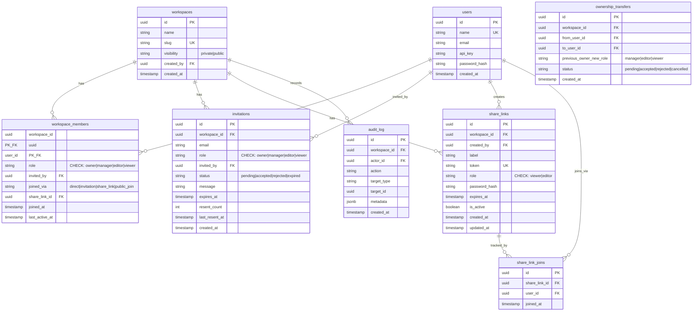

# Cowiki Role-Management System 重构设计

> 参考系统: GitHub / Overleaf / 飞书 | 2026-06-05

---

## 总图

```
┌─────────────────────────────────────────────────────────────────────────────┐
│                        Cowiki Role Management v2                             │
├─────────────────────────────────────────────────────────────────────────────┤
│                                                                              │
│  ┌─ 角色体系 (4 级) ────────────────────────────────────────────────────┐  │
│  │                                                                        │  │
│  │   Owner ──── 完全控制，唯一，可删除/转让                               │  │
│  │    │                                                                    │  │
│  │   Manager ── 管理成员+设置+邀请+分享链接，不可删除/转让                │  │
│  │    │                                                                    │  │
│  │   Editor ─── 创建/编辑/删除页面，提交/审核                             │  │
│  │    │                                                                    │  │
│  │   Viewer ─── 只读                                                      │  │
│  │                                                                        │  │
│  └────────────────────────────────────────────────────────────────────────┘  │
│                                                                              │
│  ┌─ 数据库 (全新 schema，单次 migration) ───────────────────────────────┐  │
│  │                                                                        │  │
│  │   users ────────────────────────────────── 用户表                      │  │
│  │   workspaces ───────────────────────────── 工作空间                    │  │
│  │   workspace_members ────────────────────── 成员关系 (含 role + 来源)   │  │
│  │   invitations ──────────────────────────── 邮箱邀请 (批量/过期/撤回)   │  │
│  │   share_links ──────────────────────────── 分享链接 (密码/过期)        │  │
│  │   share_link_joins ─────────────────────── 链接使用记录                │  │
│  │   audit_log ────────────────────────────── 审计日志                    │  │
│  │                                                                        │  │
│  └────────────────────────────────────────────────────────────────────────┘  │
│                                                                              │
│  ┌─ 邀请体系 (两套独立) ────────────────────────────────────────────────┐  │
│  │                                                                        │  │
│  │   邮箱邀请                        分享链接                             │  │
│  │   ┌────────────────────┐         ┌────────────────────┐               │  │
│  │   │ invitations 表      │         │ share_links 表      │               │  │
│  │   │ · email + role      │         │ · token + role      │               │  │
│  │   │ · message (可选)    │         │ · password (可选)   │               │  │
│  │   │ · expires_at (7天)  │         │ · expires_at (可选) │               │  │
│  │   │ · resent_count      │         │ · label (可选)      │               │  │
│  │   │ · 撤回/重发          │         │ · 角色天花板: Editor│               │  │
│  │   │ · 批量发送           │         │ · 链接失效=全部失效 │               │  │
│  │   └────────────────────┘         └────────────────────┘               │  │
│  │                                                                        │  │
│  └────────────────────────────────────────────────────────────────────────┘  │
│                                                                              │
│  ┌─ 权限控制 ───────────────────────────────────────────────────────────┐  │
│  │                                                                        │  │
│  │   声明式 PermissionGuard (axum extractor)                              │  │
│  │   · 自动从 DB 获取 member role                                        │  │
│  │   · 路由层声明所需权限                                                 │  │
│  │   · Handler 不再包含角色判断逻辑                                       │  │
│  │                                                                        │  │
│  └────────────────────────────────────────────────────────────────────────┘  │
│                                                                              │
│  ┌─ 前端 ───────────────────────────────────────────────────────────────┐  │
│  │                                                                        │  │
│  │   ShareDialog (三 Tab)              JoinViaLinkPage (新页面)           │  │
│  │   ┌────────────────────┐           ┌────────────────────┐             │  │
│  │   │ [邀请成员]          │           │ /join/:slug        │             │  │
│  │   │ · 批量邮箱 + 角色   │           │ · workspace 信息    │             │  │
│  │   │ · 可选消息           │           │ · 将获得的角色      │             │  │
│  │   │ · 待处理列表(撤回/重发)│         │ · 密码输入(如需)   │             │  │
│  │   │                     │           │ · [加入] 按钮       │             │  │
│  │   │ [分享链接]           │           └────────────────────┘             │  │
│  │   │ · 创建/管理链接      │                                             │  │
│  │   │ · 密码/过期设置      │           Sidebar                           │  │
│  │   │                     │           ┌────────────────────┐             │  │
│  │   │ [成员列表]           │           │ 📬 待处理邀请 (N)   │  ← badge   │  │
│  │   │ · 搜索/筛选          │           │   点击弹出邀请弹窗  │             │  │
│  │   │ · 角色修改           │           └────────────────────┘             │  │
│  │   │ · 移除成员           │                                             │  │
│  │   │ · 转让 ownership     │                                             │  │
│  │   └────────────────────┘                                              │  │
│  │                                                                        │  │
│  └────────────────────────────────────────────────────────────────────────┘  │
│                                                                              │
│  ┌─ API 路由 ───────────────────────────────────────────────────────────┐  │
│  │                                                                        │  │
│  │   Workspace CRUD     成员管理         邀请            分享链接         │  │
│  │   POST /workspaces    GET members     POST   inv     POST share-links  │  │
│  │   GET  /workspaces    POST members    GET    inv     GET  share-links  │  │
│  │   GET  /:slug         PATCH role      DELETE inv     PATCH share-links │  │
│  │   PATCH /:slug        DELETE member   POST  resend   DELETE share-links│  │
│  │   DELETE /:slug       POST join       POST  accept   POST /share/join  │  │
│  │   POST transfer       POST add-direct POST  reject   GET  /share/info  │  │
│  │                                                                        │  │
│  └────────────────────────────────────────────────────────────────────────┘  │
│                                                                              │
│  ┌─ 转让 Ownership 流程 ────────────────────────────────────────────────┐  │
│  │                                                                        │  │
│  │   Owner 发起                                                           │  │
│  │   ├─ 选择新 Owner                                                      │  │
│  │   ├─ 选择自己降级后的角色 (Manager/Editor/Viewer)                      │  │
│  │   └─ 创建 pending 转让记录                                             │  │
│  │              ↓                                                         │  │
│  │   新 Owner 收到通知 → Accept / Reject                                  │  │
│  │   Accept → 事务: 新 Owner = Owner, 旧 Owner = 选定角色                 │  │
│  │   Reject → 转让取消 (原 Owner 保持 Owner)                              │  │
│  │                                                                        │  │
│  └────────────────────────────────────────────────────────────────────────┘  │
│                                                                              │
└─────────────────────────────────────────────────────────────────────────────┘
```

---

## 目录

1. [设计决策](#1-设计决策)
2. [角色体系](#2-角色体系)
3. [数据库 Schema](#3-数据库-schema)
4. [权限控制](#4-权限控制)
5. [后端 API](#5-后端-api)
6. [前端设计](#6-前端设计)
7. [安全设计](#7-安全设计)
8. [实施计划](#8-实施计划)

---

## 1. 设计决策

| 决策项 | 决定 | 理由 |
|--------|------|------|
| 兼容旧数据库 | 不兼容，全新 schema | 旧 migration 链复杂，旧 role name 无保留价值 |
| 旧 migration 文件 | 全部删除，写一套干净 migration | 维护简单，干净起点 |
| 角色数量 | 4 级 (Owner/Manager/Editor/Viewer) | Reviewer 评论功能未排期，未来再加 |
| 邀请体系 | email 邀请 + 分享链接两套独立表 | 不同实体、不同字段、不同生命周期，不应合并 |
| 分享链接次数限制 | 去掉 max_uses/use_count | 减少复杂度，密码+过期已够用 |
| 权限检查 | 声明式 PermissionGuard (axum extractor) | Handler 不再含角色判断，权限集中管理 |
| 转让 ownership | 需新 Owner 确认 + 原 Owner 可选降级角色 | 安全，符合 GitHub 惯例 |
| 邀请提醒 UI | 侧边栏 badge + 弹窗 | 不占空间，交互简单 |

---

## 2. 角色体系

### 2.1 四级角色

```
Owner (4) ─── 完全控制，唯一，可删除/转让 workspace
  │
Manager (3) ── 管理成员+设置+邀请+分享链接，不可删除/转让
  │
Editor (2) ─── 创建/编辑/删除页面，提交/审核内容
  │
Viewer (1) ─── 只读
```

### 2.2 权限矩阵

| 操作 | Owner | Manager | Editor | Viewer |
|------|-------|---------|--------|--------|
| 查看 wiki 内容 | ✅ | ✅ | ✅ | ✅ |
| 创建/编辑页面 | ✅ | ✅ | ✅ | ❌ |
| 删除页面 | ✅ | ✅ | ✅ | ❌ |
| 提交审核 | ✅ | ✅ | ✅ | ❌ |
| 审核通过/拒绝 | ✅ | ✅ | ✅ | ❌ |
| 管理页面结构 | ✅ | ✅ | ✅ | ❌ |
| 邀请成员 | ✅ | ✅ | ❌ | ❌ |
| 移除成员 | ✅ | ✅ | ❌ | ❌ |
| 修改成员角色 | ✅ | ✅ | ❌ | ❌ |
| 管理分享链接 | ✅ | ✅ | ❌ | ❌ |
| 修改 workspace 设置 | ✅ | ✅ | ❌ | ❌ |
| 查看成员列表 | ✅ | ✅ | ✅ | ✅ |
| 查看审计日志 | ✅ | ✅ | ❌ | ❌ |
| 删除 workspace | ✅ | ❌ | ❌ | ❌ |
| 转让 ownership | ✅ | ❌ | ❌ | ❌ |
| 加入公开 workspace | ✅ | ✅ | ✅ | ✅ |

### 2.3 角色规则

1. **Owner 唯一** — 每个 workspace 有且仅有一个 Owner
2. **降级安全** — 不能将自己降级到失去管理权
3. **向上受限** — Manager 不能将自己或他人提升为 Owner
4. **权力单向递减** — Owner > Manager > Editor > Viewer

### 2.4 Rust Enum

```rust
#[derive(Debug, Clone, Copy, PartialEq, Eq, PartialOrd, Ord, Serialize, Deserialize)]
#[serde(rename_all = "lowercase")]
pub enum Role {
    Viewer = 1,
    Editor = 2,
    Manager = 3,
    Owner = 4,
}

impl Role {
    pub const ALL: &[Role] = &[Self::Viewer, Self::Editor, Self::Manager, Self::Owner];

    pub fn can_manage(&self) -> bool { *self >= Self::Manager }
    pub fn can_edit(&self) -> bool { *self >= Self::Editor }
    pub fn can_view(&self) -> bool { *self >= Self::Viewer }
    pub fn can_delete_workspace(&self) -> bool { *self == Self::Owner }
    pub fn can_transfer_ownership(&self) -> bool { *self == Self::Owner }

    /// Share links can only assign up to Editor
    pub fn is_shareable(&self) -> bool {
        matches!(self, Self::Viewer | Self::Editor)
    }

    /// Higher role manages lower role (strictly greater)
    pub fn can_manage_role(&self, target: Role) -> bool {
        *self > target
    }
}
```

---

## 3. 数据库 Schema

> 全新的单次 migration。旧 migration 文件 (001–008) 全部删除。

### 3.1 ER 图



### 3.2 Migration SQL

```sql
-- Migration 001: Initial schema (replaces all previous migrations)
-- Fresh start — no backward compatibility with old role names

-- Users
CREATE TABLE users (
    id UUID PRIMARY KEY DEFAULT gen_random_uuid(),
    name TEXT NOT NULL UNIQUE,
    email TEXT UNIQUE,
    api_key TEXT NOT NULL,
    password_hash TEXT,
    created_at TIMESTAMPTZ NOT NULL DEFAULT now()
);

-- Workspaces
CREATE TABLE workspaces (
    id UUID PRIMARY KEY DEFAULT gen_random_uuid(),
    name TEXT NOT NULL,
    slug TEXT NOT NULL UNIQUE,
    visibility TEXT NOT NULL DEFAULT 'private'
        CHECK (visibility IN ('private', 'public')),
    created_by UUID NOT NULL REFERENCES users(id),
    created_at TIMESTAMPTZ NOT NULL DEFAULT now()
);

-- Workspace members
CREATE TABLE workspace_members (
    workspace_id UUID NOT NULL REFERENCES workspaces(id) ON DELETE CASCADE,
    user_id UUID NOT NULL REFERENCES users(id) ON DELETE CASCADE,
    role TEXT NOT NULL DEFAULT 'viewer'
        CHECK (role IN ('owner', 'manager', 'editor', 'viewer')),
    invited_by UUID REFERENCES users(id),
    joined_via TEXT NOT NULL DEFAULT 'direct'
        CHECK (joined_via IN ('direct', 'invitation', 'share_link', 'public_join')),
    share_link_id UUID,  -- FK added below after share_links table created
    joined_at TIMESTAMPTZ NOT NULL DEFAULT now(),
    last_active_at TIMESTAMPTZ NOT NULL DEFAULT now(),
    PRIMARY KEY (workspace_id, user_id)
);

-- Email invitations
CREATE TABLE invitations (
    id UUID PRIMARY KEY DEFAULT gen_random_uuid(),
    workspace_id UUID NOT NULL REFERENCES workspaces(id) ON DELETE CASCADE,
    email TEXT NOT NULL,
    role TEXT NOT NULL DEFAULT 'editor'
        CHECK (role IN ('owner', 'manager', 'editor', 'viewer')),
    invited_by UUID NOT NULL REFERENCES users(id),
    status TEXT NOT NULL DEFAULT 'pending'
        CHECK (status IN ('pending', 'accepted', 'rejected', 'expired')),
    message TEXT,
    expires_at TIMESTAMPTZ NOT NULL DEFAULT (now() + INTERVAL '7 days'),
    resent_count INT NOT NULL DEFAULT 0,
    last_resent_at TIMESTAMPTZ,
    created_at TIMESTAMPTZ NOT NULL DEFAULT now()
);

CREATE INDEX idx_invitations_workspace ON invitations(workspace_id);
CREATE INDEX idx_invitations_status ON invitations(status);

-- Share links
CREATE TABLE share_links (
    id UUID PRIMARY KEY DEFAULT gen_random_uuid(),
    workspace_id UUID NOT NULL REFERENCES workspaces(id) ON DELETE CASCADE,
    created_by UUID NOT NULL REFERENCES users(id),
    label VARCHAR(100),
    token VARCHAR(64) UNIQUE NOT NULL,
    role TEXT NOT NULL DEFAULT 'viewer'
        CHECK (role IN ('viewer', 'editor')),
    password_hash VARCHAR(256),
    expires_at TIMESTAMPTZ,
    is_active BOOLEAN NOT NULL DEFAULT TRUE,
    created_at TIMESTAMPTZ NOT NULL DEFAULT now(),
    updated_at TIMESTAMPTZ NOT NULL DEFAULT now()
);

CREATE INDEX idx_share_links_workspace ON share_links(workspace_id);
CREATE UNIQUE INDEX idx_share_links_token ON share_links(token);

-- Share link join records
CREATE TABLE share_link_joins (
    id UUID PRIMARY KEY DEFAULT gen_random_uuid(),
    share_link_id UUID NOT NULL REFERENCES share_links(id) ON DELETE CASCADE,
    user_id UUID NOT NULL REFERENCES users(id),
    joined_at TIMESTAMPTZ NOT NULL DEFAULT now(),
    UNIQUE(share_link_id, user_id)
);

-- FK constraint for workspace_members referencing share_links
ALTER TABLE workspace_members
    ADD CONSTRAINT fk_member_share_link
    FOREIGN KEY (share_link_id) REFERENCES share_links(id) ON DELETE SET NULL;

-- Ownership transfers
CREATE TABLE ownership_transfers (
    id UUID PRIMARY KEY DEFAULT gen_random_uuid(),
    workspace_id UUID NOT NULL REFERENCES workspaces(id) ON DELETE CASCADE,
    from_user_id UUID NOT NULL REFERENCES users(id),
    to_user_id UUID NOT NULL REFERENCES users(id),
    previous_owner_new_role TEXT NOT NULL DEFAULT 'manager'
        CHECK (previous_owner_new_role IN ('manager', 'editor', 'viewer')),
    status TEXT NOT NULL DEFAULT 'pending'
        CHECK (status IN ('pending', 'accepted', 'rejected', 'cancelled')),
    created_at TIMESTAMPTZ NOT NULL DEFAULT now()
);

CREATE INDEX idx_transfers_workspace ON ownership_transfers(workspace_id);
CREATE INDEX idx_transfers_to_user ON ownership_transfers(to_user_id, status);

-- Audit log
CREATE TABLE audit_log (
    id UUID PRIMARY KEY DEFAULT gen_random_uuid(),
    workspace_id UUID REFERENCES workspaces(id) ON DELETE SET NULL,
    actor_id UUID NOT NULL REFERENCES users(id),
    action VARCHAR(50) NOT NULL,
    target_type VARCHAR(50),
    target_id UUID,
    metadata JSONB DEFAULT '{}',
    created_at TIMESTAMPTZ NOT NULL DEFAULT now()
);

CREATE INDEX idx_audit_log_workspace ON audit_log(workspace_id, created_at DESC);
CREATE INDEX idx_audit_log_actor ON audit_log(actor_id);
```

---

## 4. 权限控制

### 4.1 声明式 PermissionGuard

```rust
/// Permission levels, corresponding to minimum role required.
pub enum Permission {
    ViewContent,        // Viewer+
    EditContent,        // Editor+
    ManageMembers,      // Manager+
    ManageWorkspace,    // Manager+
    DeleteWorkspace,    // Owner only
    TransferOwnership,  // Owner only
}

impl Permission {
    pub fn required_role(&self) -> Role {
        match self {
            Self::DeleteWorkspace | Self::TransferOwnership => Role::Owner,
            Self::ManageMembers | Self::ManageWorkspace => Role::Manager,
            Self::EditContent => Role::Editor,
            Self::ViewContent => Role::Viewer,
        }
    }
}
```

### 4.2 使用方式

```rust
// Extractor: resolves workspace + member role from DB, then checks permission.
// Extracted from Path + Auth headers. Injects (Workspace, member Role) into handler.

async fn invite(
    State(state): State<Arc<AppState>>,
    guard: PermissionGuard,           // ← declare needed permission
    Path(slug): Path<String>,
    Json(body): Json<InviteRequest>,
) -> Result<Json<InviteResponse>> {
    guard.require(Permission::ManageMembers)?;
    // guard.workspace already resolved
    // guard.member_role already available
    // ... handler logic, no more role checks
}
```

### 4.3 路由 → 权限映射

| 路由 | 所需权限 |
|------|----------|
| `DELETE /workspaces/{slug}` | DeleteWorkspace |
| `POST /workspaces/{slug}/transfer-ownership` | TransferOwnership |
| `PATCH /workspaces/{slug}` | ManageWorkspace |
| `POST /workspaces/{slug}/invitations` | ManageMembers |
| `DELETE /workspaces/{slug}/invitations/{id}` | ManageMembers |
| `POST /workspaces/{slug}/share-links` | ManageMembers |
| `PATCH /workspaces/{slug}/share-links/{id}` | ManageMembers |
| `DELETE /workspaces/{slug}/share-links/{id}` | ManageMembers |
| `PATCH /workspaces/{slug}/members/{userId}/role` | ManageMembers |
| `DELETE /workspaces/{slug}/members/{userId}` | ManageMembers |
| `POST /workspaces/{slug}/join` | ViewContent |
| `GET /workspaces/{slug}/members` | ViewContent |
| `POST /workspaces/{slug}/pages/...` | EditContent |
| `GET /workspaces/{slug}/...` | ViewContent |

---

## 5. 后端 API

### 5.1 路由总览

```
# ── Workspace ──
POST   /api/workspaces                                 创建 workspace
GET    /api/workspaces                                 我的 workspace 列表
GET    /api/workspaces/public                          公开 workspace 列表
GET    /api/workspaces/{slug}                          workspace 详情
PATCH  /api/workspaces/{slug}                          更新设置 (Manager+)
DELETE /api/workspaces/{slug}                          删除 (Owner only)
POST   /api/workspaces/{slug}/transfer-ownership       发起转让 (Owner only)
GET    /api/transfers/pending                           我的待处理转让
POST   /api/transfers/{id}/accept                       接受转让
POST   /api/transfers/{id}/reject                       拒绝转让
DELETE /api/transfers/{id}                              取消转让 (发起者)

# ── 成员管理 ──
GET    /api/workspaces/{slug}/members                  成员列表
POST   /api/workspaces/{slug}/members                  直接添加已有用户 (Manager+)
PATCH  /api/workspaces/{slug}/members/{userId}/role    修改角色 (Manager+)
DELETE /api/workspaces/{slug}/members/{userId}         移除成员 (Manager+)
POST   /api/workspaces/{slug}/join                     公开加入

# ── 邮箱邀请 ──
POST   /api/workspaces/{slug}/invitations              发送邀请 (支持批量, Manager+)
GET    /api/workspaces/{slug}/invitations              邀请列表 (Manager+)
POST   /api/workspaces/{slug}/invitations/{id}/resend  重发邀请 (Manager+)
DELETE /api/workspaces/{slug}/invitations/{id}         撤回邀请 (Manager+)
GET    /api/invitations/pending                        我的待处理邀请
POST   /api/invitations/{id}/accept                    接受邀请
POST   /api/invitations/{id}/reject                    拒绝邀请

# ── 分享链接 ──
POST   /api/workspaces/{slug}/share-links              创建分享链接 (Manager+)
GET    /api/workspaces/{slug}/share-links              分享链接列表 (Manager+)
PATCH  /api/workspaces/{slug}/share-links/{id}         更新链接设置 (Manager+)
DELETE /api/workspaces/{slug}/share-links/{id}         撤销链接 (Manager+)
POST   /api/share/{token}/join                        通过链接加入
GET    /api/share/{token}/info                        获取链接信息 (无需认证)

# ── 审计日志 ──
GET    /api/workspaces/{slug}/audit-log                审计日志 (Manager+)
```

### 5.2 关键 API 详情

#### 批量邀请

```
POST /api/workspaces/{slug}/invitations
Auth: Manager+
Body: {
  "invitations": [
    { "email": "a@example.com", "role": "editor", "message": "欢迎!" },
    { "email": "b@example.com", "role": "viewer" }
  ]
}
Response 201: {
  "sent": 2,
  "failed": 0,
  "results": [
    { "email": "a@example.com", "status": "sent", "invitation_id": "uuid" },
    { "email": "b@example.com", "status": "sent", "invitation_id": "uuid" }
  ]
}
```

#### 创建分享链接

```
POST /api/workspaces/{slug}/share-links
Auth: Manager+
Body: {
  "label": "设计审核用",        // 可选
  "role": "viewer",             // viewer | editor (天花板)
  "password": "...",            // 可选
  "expires_at": "2026-07-01T00:00:00Z"  // 可选
}
Response 201: {
  "id": "uuid",
  "token": "64-char-random-token",
  "url": "https://cowiki.example.com/join/{slug}?token={token}",
  "label": "设计审核用",
  "role": "viewer",
  "has_password": true,
  "expires_at": "2026-07-01T00:00:00Z",
  "is_active": true,
  "created_at": "2026-06-05T..."
}
```

#### 通过链接加入

```
POST /api/share/{token}/join
Auth: required
Body: { "password": "..." }    // 如链接设置了密码
Response 200: {
  "workspace": { "name": "...", "slug": "..." },
  "role": "viewer",
  "joined_via": "share_link"
}
Errors:
  404 → 链接不存在或已失效
  403 → 密码错误
  410 → 链接已过期
  409 → 已是成员
```

#### 获取链接信息（无需认证）

```
GET /api/share/{token}/info
Auth: optional
Response 200: {
  "workspace": { "name": "设计知识库", "slug": "design" },
  "role": "viewer",
  "requires_password": true,
  "expires_at": "2026-07-01T00:00:00Z",
  "is_active": true,
  "member_count": 12
}
```

#### 转让 Ownership

```
POST /api/workspaces/{slug}/transfer-ownership
Auth: Owner only
Body: {
  "new_owner_user_id": "uuid",
  "previous_owner_role": "manager"   // 原 Owner 降级后的角色
}
Response 201: {
  "id": "uuid",
  "status": "pending",
  "new_owner_name": "...",
  "created_at": "2026-06-05T..."
}
// 创建 pending 转让记录

POST /api/transfers/{id}/accept
Auth: 新 Owner (to_user_id 匹配)
// → 事务: 新 Owner = owner, 旧 Owner = 选定角色
Response 200: { "status": "accepted" }

POST /api/transfers/{id}/reject
Auth: 新 Owner (to_user_id 匹配)
Response 200: { "status": "rejected" }

DELETE /api/transfers/{id}
Auth: 原 Owner (from_user_id 匹配)
Response 200: { "status": "cancelled" }
```

---

## 6. 前端设计

### 6.1 组件结构

```
web/src/
├── components/
│   ├── share/
│   │   ├── ShareDialog.tsx             ← 主弹窗 (三 Tab 容器)
│   │   ├── InviteMembersTab.tsx        ← 批量邀请 + 待处理列表
│   │   ├── ShareLinksTab.tsx           ← 分享链接管理
│   │   ├── CreateShareLinkDialog.tsx   ← 创建链接子弹窗
│   │   ├── ShareLinkCard.tsx           ← 单个链接卡片
│   │   └── MembersTab.tsx              ← 成员管理 (含转让)
│   ├── workspace/
│   │   ├── JoinViaLinkPage.tsx         ← /join/:slug 页面
│   │   ├── PendingInvitationsPopover.tsx ← 侧边栏 badge 弹窗
│   │   └── TransferOwnershipDialog.tsx
│   └── ...
├── hooks/
│   ├── useShareLinks.ts
│   ├── useInvitations.ts
│   └── useMembers.ts
└── ...
```

### 6.2 ShareDialog 三 Tab

```
┌─────────────────────────────────────────────────┐
│  Share "设计知识库"                     [×]      │
├─────────────────────────────────────────────────┤
│  [邀请成员]  [分享链接]  [成员列表(12)]          │
├─────────────────────────────────────────────────┤
│                                                  │
│  (Tab 内容按选择切换)                            │
│                                                  │
│  邀请成员 Tab:                                   │
│  · 批量邮箱输入 (逗号分隔)                       │
│  · 角色下拉 (Manager/Editor/Viewer)             │
│  · 可选消息                                      │
│  · [发送邀请]                                    │
│  · 待处理邀请列表 (撤回/重发)                    │
│                                                  │
│  分享链接 Tab:                                   │
│  · [+ 创建新链接]                                │
│  · 活跃链接卡片列表 (复制/设置/失效)             │
│                                                  │
│  成员 Tab:                                       │
│  · 搜索/筛选                                     │
│  · 成员列表 (头像/姓名/角色/加入方式)            │
│  · 角色修改下拉 (Manager+)                       │
│  · 移除按钮 (Manager+)                           │
│  · 转让 ownership 按钮 (Owner only)              │
└─────────────────────────────────────────────────┘
```

### 6.3 侧边栏邀请提醒

```
┌─ Sidebar ───────────────────────┐
│                                  │
│  📁 我的 Space                   │
│  📁 设计团队 (Editor)            │
│  📁 前端组件库 (Viewer)          │
│  ...                             │
│                                  │
│  ┌────────────────────────────┐  │
│  │ 📬 待处理邀请 (2)   ← badge│  │
│  └────────────────────────────┘  │
│                                  │
│  点击 badge → 弹出 Popover:      │
│  ┌────────────────────────────┐  │
│  │ 📧 设计团队 — Editor       │  │
│  │    3天前                   │  │
│  │    [接受] [拒绝]           │  │
│  │ ────────────────────────── │  │
│  │ 📧 前端组件库 — Viewer     │  │
│  │    1天前                   │  │
│  │    [接受] [拒绝]           │  │
│  └────────────────────────────┘  │
└──────────────────────────────────┘
```

### 6.4 JoinViaLinkPage

```
┌──────────────────────────────────────┐
│              🐮 cowiki                │
│                                       │
│   ┌────────────────────────┐         │
│   │  📚 设计知识库          │         │
│   │                        │         │
│   │  加入角色: Viewer     │         │
│   │  已有成员: 12 人       │         │
│   │                        │         │
│   │  [密码输入框 (如需)]   │         │
│   │                        │         │
│   │  [🔗 加入此 Workspace]  │         │
│   │                        │         │
│   │  需要 cowiki 账号      │         │
│   │  [去登录] [去注册]     │         │
│   └────────────────────────┘         │
└──────────────────────────────────────┘
```

---

## 7. 安全设计

### 7.1 分享链接安全

| 措施 | 说明 |
|------|------|
| Token | 64-char cryptographically random (URL-safe base64) |
| 密码哈希 | bcrypt, cost >= 12 |
| 角色天花板 | 最高 Editor，不可 Manager/Owner |
| 速率限制 | 单 IP 10次/小时 |
| 审计追踪 | share_link_joins + audit_log |
| 失效级联 | 链接失效不影响已加入者 |

### 7.2 邀请安全

| 措施 | 说明 |
|------|------|
| 邮箱验证 | accept 时验证当前用户 email === 邀请 email |
| 过期 | 默认 7 天，后台任务标记 expired |
| 重复拒绝 | 同一邮箱+同一 workspace 已有 pending 邀请时拒绝新建 |
| 角色限制 | Manager 不能邀请 Owner |
| 不能邀请自己 | 不能邀请已是成员的用户 |

### 7.3 权限边界

```
Owner:   可管理所有角色 (含 Manager)
         唯一可删除 workspace
         唯一可转让 ownership

Manager: 可管理 Editor/Viewer
         不能管理 Owner
         不能提升为 Owner
         不能删除 workspace
         不能转让 ownership
```

---

## 8. 实施计划

### Phase 1: 全新数据库 schema
- 删除旧 migration 文件 (001–008)
- 写新的 `001_init.sql`
- 更新 `run_migrations()` 只跑新 migration
- 更新 Rust `Role` enum (4 级)
- 更新所有 DB 函数适配新 schema

### Phase 2: 权限中间件
- 实现 `PermissionGuard` extractor
- 重构所有路由 handler，移除硬编码 role check
- 权限矩阵测试全覆盖

### Phase 3: 邀请系统增强
- 批量邀请 API
- 邀请撤回/重发
- 邀请过期处理
- API 测试

### Phase 4: 分享链接
- ShareLink CRUD API
- Join via link API
- 密码验证 + 过期逻辑
- API 测试

### Phase 5: 转让 Ownership
- 转让 API（pending 记录 + 确认流程）
- 测试

### Phase 6: 前端重构
- ShareDialog 三 Tab 重构
- JoinViaLinkPage
- 侧边栏 badge + 弹窗
- 权限驱动 UI 显隐
- E2E 测试

---

> **下一步**: 确认此设计后，进入 implementation plan 阶段。
