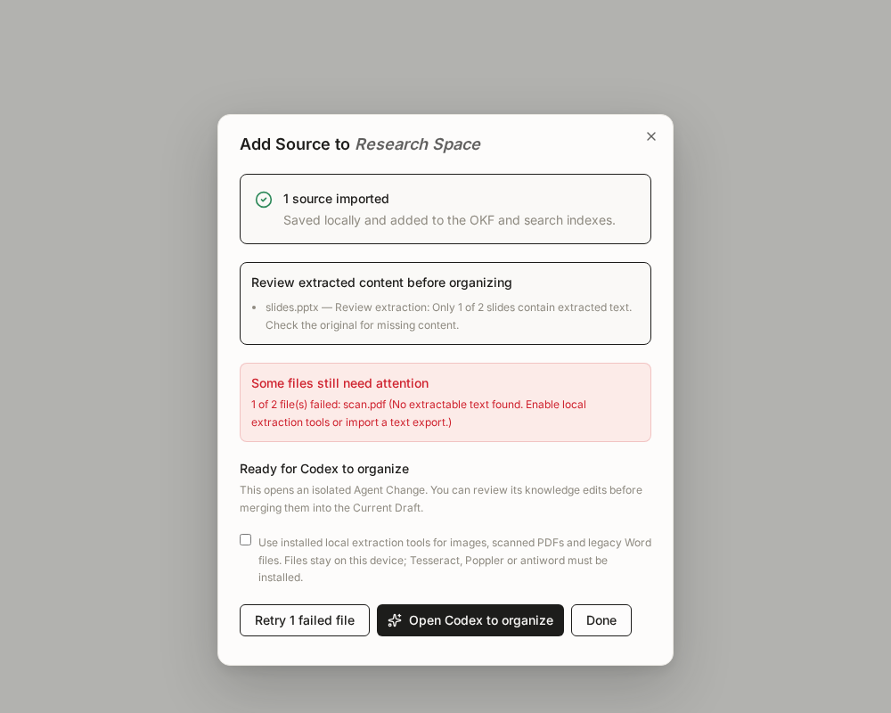

# Source extraction and quality

File import returns a structured extraction report and stores it in the Source's
`cowiki_extraction` frontmatter alongside `source_hash` and `source_extraction_hash`. Markdown and Git retain
this evidence when a Space is cloned; SQLite remains a rebuildable index.

| Status | Meaning |
|---|---|
| `pass` | The available checks found no issue. This is not a guarantee of semantic fidelity. |
| `warn` | Readable content was imported, with limitations or incomplete coverage to review. |
| `fallback` | An alternative extractor recovered readable content. Diagnostics still require review. |
| `fail` | No Source is written. The batch continues, and the file remains available for retry. |

Reports contain the format, selected extractor and contract version, character
count, available expected/extracted unit counts, attempted extraction paths, and
actionable diagnostics. PPTX coverage counts slides; spreadsheet coverage counts
sheets. Empty units are reported because they can contain visual-only content.
PDF coverage is checked per page. A readable text page cannot hide an empty or
unreadable page elsewhere in the document: that import requires recovery and
fails without complete output. With local tools enabled, Poppler text is kept
for readable pages and OCR is attempted for the missing pages. This conservative
check also flags genuinely blank pages; export/remove those pages when OCR
cannot recover content. Text within an otherwise readable page can still be
incomplete, so page coverage does not prove visual or semantic fidelity.
DOCX native output is compared with document XML text; missing content falls back
to a formatting-flattened XML extraction. Empty or predominantly unreadable glyph
output fails, while partial damage is visible. These heuristics do not infer
correct PDF reading order, OCR accuracy, chart meaning or document completeness.

Inputs are copied into a private, size-bounded temporary snapshot before parsing.
The hash describes the exact bytes extracted, even if the original is later
edited. Existing input, archive expansion, entry-count and output-size limits
remain in force. Re-importing identical bytes with the same extracted text preserves the existing
Source and its human/Agent annotations. Improved extraction creates a separate,
deterministic Source; old Sources are not silently overwritten or rewritten to add metadata.

Structured text (JSON, YAML, CSV/TSV, XML and local HTML listings) is preserved in
Markdown code fences. Local HTML uses a `text` fence so it cannot become an
interactive HTML View. Web-page capture uses the URL adapter already on `dev`
(PR #144). The shared Source writer preserves its origin URL and capture metadata.
Web identity includes both the URL and content hash, so several URLs with the
same title and body remain distinct from each other and from imported files.
Re-imports also recognize the adapter's older hash-suffixed paths, preserving
existing annotations without migrating or rewriting Sources.

## Optional local converters

In the desktop file-import tab, enable **Use installed local extraction tools**
for this import. No converter runs without that choice, and no Cloud service or
account is required. CoWiki does not install tools automatically.

- Images: Tesseract (`tesseract`). Install language data appropriate to your input;
  the current adapter uses the tool's default language.
- PDF recovery: Poppler (`pdfinfo`, `pdftotext`, `pdftoppm`) and Tesseract.
- Legacy `.doc`: antiword.

The adapter launches fixed programs and argument arrays without a shell, with a
clean environment and closed stdin.
Tools are resolved to absolute executable paths before the environment is
cleared. On Windows, add the native `.exe` directories to PATH and restart
CoWiki; batch/PowerShell wrappers and WSL-only tools are unsupported. On Unix,
absolute PATH entries and standard system/Homebrew directories are searched.
Only OS temporary/system directory variables are retained for converter startup.
No Agent or Cloud credentials are inherited.

Local extraction has a 90-second total budget
and a 32 MiB text limit. Scanned PDFs are limited to 20 pages; pages render at up
to 2,000 pixels on their longest edge. A missing tool, timeout or unreadable OCR
page produces an actionable failure; an incomplete OCR PDF is never presented as
a complete import. Files stay local. These tools run as ordinary local processes,
not inside a CoWiki operating-system sandbox.

OCR output and PDF layout still require human review. Paid/external parsing
providers are not selected implicitly; adding one needs a separate explicit
provider contract and privacy decision.



## Verification

Run the normal web and Rust suites. Regression fixtures cover partial slide
coverage, DOCX nested text recovery, unreadable nonempty input, Unicode text,
structured-text fences, opt-in conversion, tool timeouts, batch failures and
portable quality metadata. No test requires an external model or network service.
The checked-in mixed PDF has one text page and one image-only page. Its ordinary
test rejects partial native extraction; the opt-in real Poppler/Tesseract test
recovers both pages and confirms that OCR runs only for the scanned page. A second
integration test reopens the local engine and verifies that re-importing the
recovered PDF preserves the Source and its annotations:

```sh
cargo test --locked --manifest-path web/src-tauri/Cargo.toml mixed_pdf_ -- --ignored --nocapture
```
